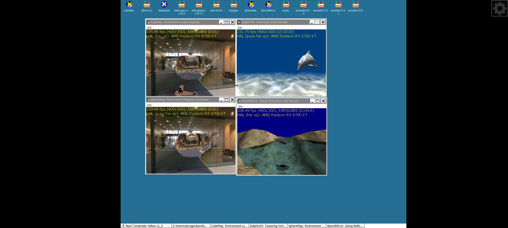

> [!NOTE]
> 当前为 v0.3-beta 频道

> [!WARNING]
> 本模拟器尚处于测试阶段，不排除存在未知问题。对此造成的不便敬请谅解
# GQE-模拟器
GQE是一个在Android ARM64设备上运行windows x86_64程序的模拟器，无需root，依赖[Termux](https://github.com/termux/termux-app)，[Termux-X11](https://github.com/termux/termux-x11)，和[InputBridge](https://inputbridge.net/)
<br>

<br>
<br>
有改进想法？请提交拉取请求 — 我们接受建设性贡献
# 安装
在Termux中执行以下命令
<br>
```bash
curl -s -o g https://gh-proxy.org/https://raw.githubusercontent.com/ocnedkf/GQE-emulator/refs/heads/v0.3-beta/zh_CN/install-sh && chmod +x g && ./g
```

# 启动 GQE
执行以下命令
```bash
start-gqe
```

# 终止 GQE
关闭所有窗口或执行以下命令
```bash
kill-gqe
```

# 配置 GQE
你可以在`/storage/emulator/0/.gqe-start`路径下找到配置文件

| 文件名 | 作用说明 |
|---|---|
| `all_var.txt` | GQE 全局环境变量 |
| `dxvk.conf` | DXVK 配置文件 |
| `mesa_var.txt` | Mesa Gallium 驱动选择环境变量 |
| `mesa_var_v.txt` | Mesa Vulkan 驱动选择环境变量 |
| `mesa_var_f.txt` | 指向 Vulkan ICD‑JSON 文本清单文件 |
| `log.txt` | Wine 运行时日志文件 |


# 修复 GQE
执行 `start-gqe -f`以修复前缀或重新初始化
> [!Tip]
> 若只想重新初始化，在执行命令前删除前缀文件即可
> 
> 前缀文件目录在 `$HOME/.gqe-data-v0.3/.wine`

# 卸载
执行以下命令
<br>
警告：这会删除GQE及其内的所有数据
<br>
不要在未安装GQE的情况下尝试执行！！！
<br>
```bash
curl -s -o u https://gh-proxy.org/https://raw.githubusercontent.com/ocnedkf/GQE-emulator/refs/heads/v0.3-beta/zh_CN/uninstall-gqe && chmod +x u && ./u
```

# 设备要求
一台Android版本大于等于7的ARM64设备，并确保剩余至少5GB的存储空间
# 第三方应用程序

[Box64](https://github.com/Pipetto-crypto/box64)

[DXVK](https://github.com/doitsujin/dxvk)

[VKD3D](https://github.com/HansKristian-Work/vkd3d-proton)

[D8VK](https://github.com/AlpyneDreams/d8vk)

[D7VK](https://github.com/WinterSnowfall/d7vk)

[Termux-APP](https://github.com/termux/termux-app)

[Termux-X11](https://github.com/termux/termux-x11)

[Termux-Packages](https://github.com/termux/termux-packages)

[Termux-Glibc-Packages](https://github.com/termux-pacman/glibc-packages)

[DXVK-ASYNC](https://github.com/Sporif/dxvk-async)

[DXVK-GPLASYNC](https://gitlab.com/Ph42oN/dxvk-gplasync)

[Mesa](https://gitlab.freedesktop.org/mesa/mesa/)

[Mesa-Turnip](https://github.com/K11MCH1/WinlatorTurnipDrivers)

[Mesa-VirGL](https://github.com/alexvorxx/Mesa-VirGL)

[Proton-Wine](https://github.com/ocnedkf/proton-wine-custom)

[Wine](https://github.com/ocnedkf/wine-custom)

[Wine-Gecko](https://gitlab.winehq.org/wine/wine-gecko)

[Wine-Mono](https://gitlab.winehq.org/mono/wine-mono)

[WineD3D](https://downloads.fdossena.com/Projects/WineD3D/Builds/)

[Ubuntu-Packages](https://packages.ubuntu.com/noble/)

[InputBridge](https://inputbridge.net/)

[Tiny File Manager-zh](https://github.com/ocnedkf/tfm)

[7-Zip](https://7-zip.org/)
