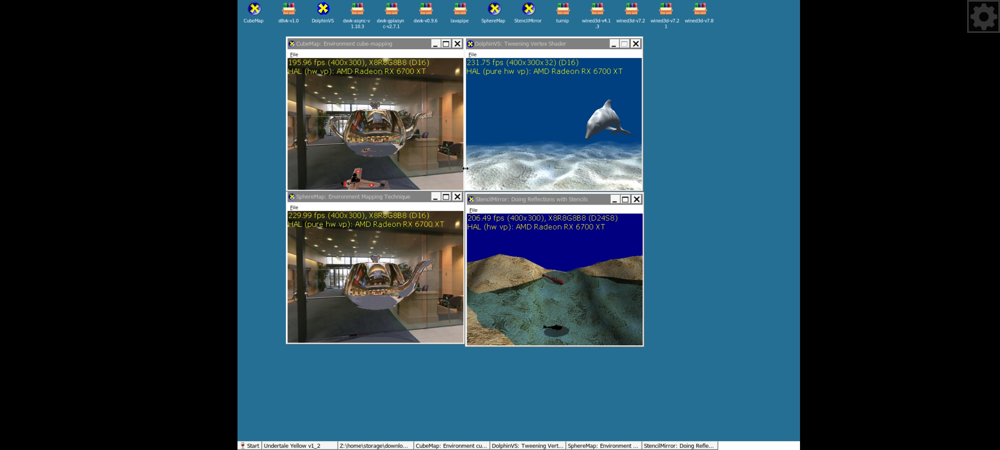

[中文](https://github.com/ocnedkf/GQE-emulator/blob/main/README-zh_CN.md)
# WARNING
This emulator is still in the beta stage, so there may be several bugs that have not yet been discovered. We apologize for any inconvenience this may cause and appreciate your understanding
# GQE-emulator

GQE is an emulator that runs Windows x86_64 programs on Android ARM64 devices, relying on Termux, Termux-x11, and InputBridge
 

 

# Installation
Execute the following command in Termux (ensure that the 64-bit version is used)
 

  $ curl -s -o g https://raw.githubusercontent.com/ocnedkf/GQE-emulator/refs/heads/main/install-sh && chmod +x g && ./g

# Device Requirements
An Android ARM64 device with Android version 7 or above, requiring at least approximately 5GB of space

# Third party applications

[Box64](https://github.com/Pipetto-crypto/box64)

[DXVK](https://github.com/doitsujin/dxvk)

[D8VK](https://github.com/AlpyneDreams/d8vk)

[Termux-APP](https://github.com/termux/termux-app)

[Termux-Glibc-Packages](https://github.com/termux-pacman/glibc-packages)

[DXVK-ASYNC](https://github.com/Sporif/dxvk-async)

[DXVK-GPLASYNC](https://gitlab.com/Ph42oN/dxvk-gplasync)

[Mesa Turnip](https://github.com/K11MCH1/WinlatorTurnipDrivers)

[Wine-Gecko](https://gitlab.winehq.org/wine/wine-gecko)

[Wine-Mono](https://gitlab.winehq.org/mono/wine-mono)

[Wine](https://github.com/ocnedkf/wine-custom)
